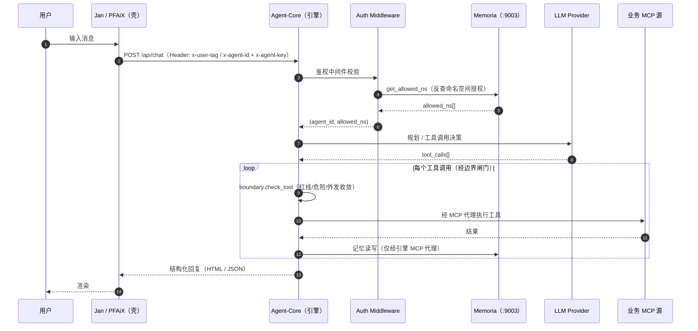
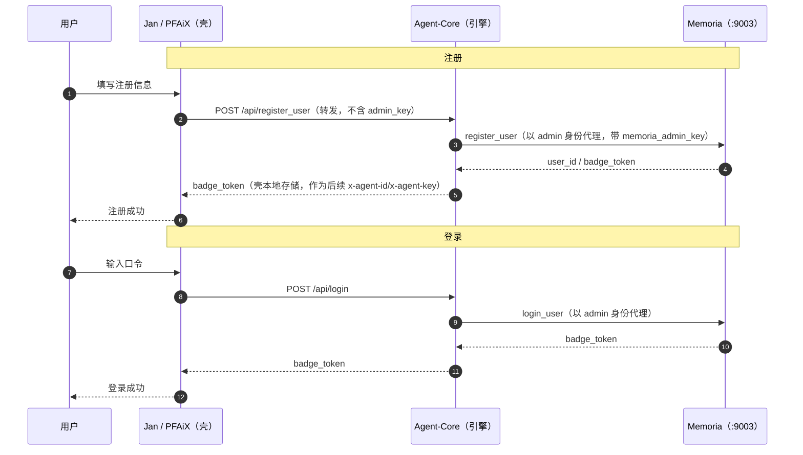
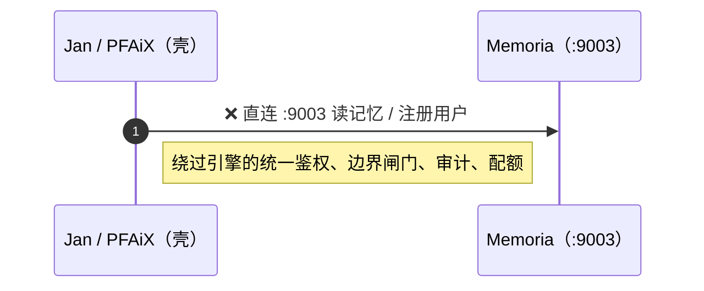

# 桌面壳（Jan / PFAiX）与引擎（Agent-Core）边界

> 配套 ADR：见 `docs/decisions/ADR-003-unified-auth-localhost.md`
> 本文档用序列图固化「壳只做壳、一切经引擎」的边界，避免壳侧直连内网 Memoria 的分叉实现。

## 1. 铁律（非协商）

1. **Agent-Core 是唯一引擎**：持有 LLM 路由、MCP 源连接、边界/红线闸门、配额、审计、Checkpoint。
2. **Jan / PFAiX（桌面壳）只做壳**：UI、本地配置持久化、把用户输入封装为 HTTP 请求发给 Agent-Core。
3. **壳不得直连内网 Memoria**：壳侧**绝不**持有 `memoria_admin_key`，也**绝不**直连 `:9003`。
   所有 Memoria 访问（记忆读写、命名空间反查、注册/登录代理）**必须经 Agent-Core 的 MCP 代理**。
4. **禁止分叉实现**：壳侧不得重实现一套「本地直连 Memoria 的鉴权/记忆逻辑」——
   那样会绕过引擎的统一鉴权、边界闸门与审计，形成安全盲区。

## 2. 正常对话序列图

**要点**：壳全程只与 `Agent-Core` 的 HTTP 接口对话；`Memoria` 对壳不可见。

## 3. 注册 / 登录代理序列图（壳不直接碰 Memoria 账户体系）

**要点**：`memoria_admin_key` **只存在于 Agent-Core 进程环境变量**，壳永远拿不到；
壳只持有登录后下发的 `badge_token`，且经引擎转发而非自行直连。

## 4. 反模式（禁止）

任何「壳侧自带 Memoria client + admin_key」的实现都违反本文档铁律第 3 条，
会在引擎之外形成未受控的数据面，必须删除。

## 5. 运维校验清单

- [ ] 壳进程环境变量中**不存在** `memoria_admin_key` / 直连 Memoria 的 token。
- [ ] 壳的网络出口只有到 `Agent-Core`（默认 `127.0.0.1:9753`）的连接，无到 `:9003` 的连接。
- [ ] 新增「记忆/账户」能力时，只在 `Agent-Core` 侧实现，壳仅暴露 UI 与转发。
